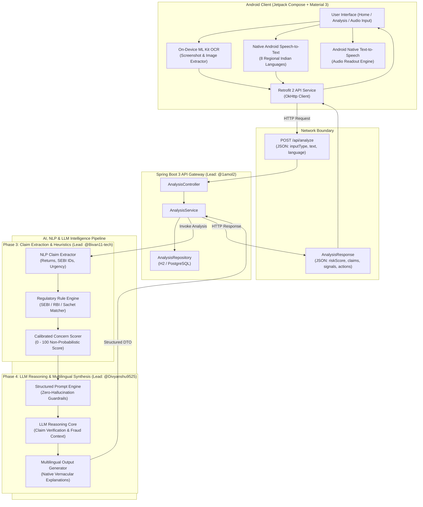

# SATARK (सतर्क)
### Multilingual Investor Scam & Financial Fraud Safety Platform

[](https://developer.android.com)
[](https://developer.android.com/jetpack/compose)
[](https://m3.material.io)
[](https://spring.io/projects/spring-boot)
[](https://www.oracle.com/java/)
[](https://kotlinlang.org/)
[](https://developers.google.com/ml-kit)
[](#-supported-regional-languages)
[](LICENSE)

**SATARK (सतर्क — Vigilant)** is an intelligent, full-stack fraud detection and investor safety ecosystem designed to protect retail investors, students, senior citizens, and first-time market participants from financial fraud, unauthorized advisory services, fake SEBI registration credentials, high-risk pump-and-dump tips, and deceptive social-media schemes across WhatsApp, Telegram, SMS, and Instagram.

---

## 📌 Table of Contents
- [Problem Statement](#-problem-statement)
- [System Architecture](#-system-architecture)
- [Key Features](#-key-features)
- [Repository Structure](#-repository-structure)
- [Backend REST API Specification](#-backend-rest-api-specification)
- [AI, NLP & LLM Risk Engine Guide](#-ai-nlp--llm-risk-engine-guide)
  - [Phase 3: NLP Claim Extraction & Risk Heuristics (@Bivan11-tech)](#phase-3-nlp-claim-extraction--risk-heuristics-bivan11-tech)
  - [Phase 4: LLM Response Engine & Multilingual Reasoning (@Divyanshu9525)](#phase-4-llm-response-engine--multilingual-reasoning-divyanshu9525)
- [Supported Regional Languages](#-supported-regional-languages)
- [Development Setup & Installation](#-development-setup--installation)
- [Core Team & Contributors](#-core-team--contributors)
- [Safety & Legal Disclaimer](#-safety--legal-disclaimer)

---

## 🎯 Problem Statement
Financial fraud in India has shifted towards hyper-targeted social media engineering:
1. **Unregistered "Gurus" & Advisory Channels**: Unlicensed operators promising guaranteed daily returns on Telegram and WhatsApp groups.
2. **Forged Credentials**: Fabricated SEBI certificates, forged RBI registration numbers, and spoofed government endorsements.
3. **Language & Literacy Barriers**: Rural and vernacular language speakers are disproportionately targeted with audio messages and vernacular flyers where traditional safety warnings fail.
4. **Binary Scam Check Limitations**: Most tools offer a vague "yes/no" or "trust score" without breaking down falsifiable claims, legal red flags, or concrete next steps.

**SATARK** solves this through multi-modal input (Text, Screenshot OCR, Regional Speech), precise claim extraction, algorithmic risk scoring, and LLM-driven contextual explanations generated natively in **8 Indian regional languages**.

---

## 🏛️ System Architecture



---

## ✨ Key Features

- 📸 **On-Device Optical Character Recognition (Google ML Kit)**: Instant client-side text recognition from WhatsApp screenshots, Telegram posts, and investment brochures without uploading user photos to external servers.
- 🎙️ **Multilingual Voice Input (Speech-to-Text)**: Complete hands-free input allowing users to speak suspicious messages in their native language with automatic regional speech recognition.
- 🔊 **Regional Audio Safety Readout (Text-to-Speech)**: Audio explanation read aloud in the user's selected regional language, enabling accessibility for non-readers and visually impaired users.
- 🚦 **Calibrated Concern Rating (0–100 Score)**: An objective, evidence-based score accompanied by clear risk categories:
  - `0–34`: **LOW** (Standard communication / verified regulatory context)
  - `35–59`: **MEDIUM** (Missing mandatory disclaimers, promotional tone)
  - `60–79`: **HIGH** (Unverified advisor claims, high pressure tactics)
  - `80–100`: **VERY HIGH** (Guaranteed returns, forged registration, immediate transfer demands)
- 🔍 **Granular Claim & Evidence Breakdown**: Extracts specific claims (e.g. *"Guaranteed 30% monthly return"*), attaches evidence status (`INSUFFICIENT_EVIDENCE`, `VERIFIED_FALSE`), and tags risk signals.
- 🛡️ **Actionable Protection Directives**: Directly directs victims to official portals (National Cyber Crime Helpline `1930`, `cybercrime.gov.in`, SEBI SCORES portal).

---

## 📁 Repository Structure

```
Satark/
├── .gitignore                     # Monorepo build & IDE exclusion rules
├── README.md                      # Primary project documentation & architecture guide
├── android/                       # Native Android Application (Client)
│   ├── app/
│   │   ├── build.gradle.kts       # Dependencies (Compose, ML Kit, Retrofit, Navigation)
│   │   └── src/main/
│   │       ├── AndroidManifest.xml # Permissions (Microphone, Internet, Audio)
│   │       ├── java/com/satark/
│   │       │   ├── data/          # Retrofit API clients & Models
│   │       │   ├── ui/            # Jetpack Compose UI (Screens, Theme, Components)
│   │       │   ├── util/          # ML Kit OCR & Audio helpers
│   │       │   └── MainActivity.kt# Application entry & navigation
│   │       └── res/               # Vector drawables, themes, and localized strings
│   ├── build.gradle.kts           # Top-level Gradle configuration
│   └── settings.gradle.kts        # Android module bindings
└── backend/                       # Spring Boot 3 Analysis Engine (Server)
    ├── pom.xml / build.gradle     # Spring Boot Web, Validation, Lombok, JPA
    └── src/main/
        ├── java/com/satark/backend/
        │   ├── controller/        # AnalysisController (REST Endpoints)
        │   ├── dto/               # AnalysisRequest & AnalysisResponse records
        │   ├── exception/         # GlobalExceptionHandler
        │   ├── model/             # Analysis, Claim, Evidence, RiskSignal entities
        │   ├── repository/        # AnalysisRepository interface
        │   ├── service/           # AnalysisService (Business Logic & AI Hook)
        │   └── BackendApplication.java
        └── resources/
            └── application.properties # Server port, database, and LLM API keys
```

---

## 🔌 Backend REST API Specification

### Endpoint: Analyze Financial Message
`POST /api/analyze`

#### Request Headers
```http
Content-Type: application/json
Accept: application/json
```

#### Request Body (`AnalysisRequest`)
```json
{
  "inputType": "TEXT",
  "text": "Join our VIP Telegram group! Guaranteed 30% monthly return with zero risk. SEBI registered analyst Amit Sharma. Only 5 slots remaining. Pay Rs 5000 to UPI ID fastprofit@upi to start immediately.",
  "language": "hi"
}
```

| Field | Type | Required | Description |
| :--- | :--- | :--- | :--- |
| `inputType` | `String` | Yes | Type of input source: `"TEXT"`, `"OCR"`, or `"VOICE"`. |
| `text` | `String` | Yes | The extracted or transcribed message body to evaluate. |
| `language` | `String` | No | Target ISO 639-1 code for explanation (`"en"`, `"hi"`, `"ta"`, etc.). Default: `"en"`. |

#### Response Body (`AnalysisResponse`)
```json
{
  "analysisId": "8f3b2075-ef19-482a-a9da-19ce92548cb4",
  "riskScore": 92,
  "riskLevel": "VERY_HIGH",
  "claims": [
    {
      "claimText": "Guaranteed 30% monthly return with zero risk",
      "category": "GUARANTEED_RETURN",
      "confidence": "HIGH"
    },
    {
      "claimText": "SEBI registered analyst Amit Sharma",
      "category": "REGISTRATION_CLAIM",
      "confidence": "MEDIUM"
    },
    {
      "claimText": "Only 5 slots remaining. Pay Rs 5000 immediately",
      "category": "URGENCY_PRESSURE",
      "confidence": "HIGH"
    }
  ],
  "riskSignals": [
    {
      "title": "Unrealistic Guaranteed Returns",
      "description": "Legitimate equity investments cannot guarantee fixed returns. SEBI regulations strictly prohibit promising guaranteed profit.",
      "severity": "CRITICAL"
    },
    {
      "title": "Artificial Urgency & Scarcity",
      "description": "Manipulative tactics like 'only 5 slots remaining' are designed to rush victims before they can verify claims.",
      "severity": "HIGH"
    },
    {
      "title": "Personal UPI Payment Channel",
      "description": "Registered entities collect payments through official accounts, not private UPI handles.",
      "severity": "HIGH"
    }
  ],
  "evidence": [
    {
      "claim": "SEBI registered analyst Amit Sharma",
      "status": "UNVERIFIED",
      "details": "No SEBI registration number was provided. Registered advisors must mandatorily state their registration ID.",
      "sourceUrl": "https://www.sebi.gov.in/sebiweb/other/OtherAction.do?doRecognisedFpi=yes&intmId=13"
    }
  ],
  "explanation": "यह संदेश अत्यंत संदिग्ध है। इसमें 30% गारंटीड मुनाफे का दावा किया गया है, जो सेबी (SEBI) नियमों के खिलाफ है। किसी भी व्यक्तिगत यूपीआई पर पैसे ट्रांसफर न करें।",
  "recommendedActions": [
    "किसी भी अनजान यूपीआई या बैंक खाते में पैसे ट्रांसफर न करें।",
    "सेबी की आधिकारिक वेबसाइट (sebi.gov.in) पर जाकर एडवाइजर की मान्यता जांचें।",
    "यदि धोखाधड़ी हो चुकी है, तो तुरंत राष्ट्रीय साइबर हेल्पलाइन 1930 पर कॉल करें या cybercrime.gov.in पर रिपोर्ट दर्ज करें।"
  ]
}
```

---

## 🧠 AI, NLP & LLM Risk Engine Guide

The intelligence layer is decoupled into two collaborative phases:

### Phase 3: NLP Claim Extraction & Risk Heuristics (@Bivan11-tech)
**Objective**: Parse raw text, extract atomic claims, test against regulatory knowledge rules, and calculate a calibrated concern score.

1. **Named Entity & Pattern Extraction**:
   - Extract SEBI Registration IDs (`INA[0-9]{9}`, `INH[0-9]{9}`).
   - Extract payment handles (`UPI IDs`, `phone numbers`, `bank links`).
   - Extract numerical promises (`percentage returns`, `double money in X days`, `jackpot calls`).
2. **Category Classification**:
   - `GUARANTEED_RETURN`: Any assurance of capital preservation or fixed return in equities/crypto.
   - `REGULATORY_IMPERSONATION`: Unsubstantiated claims of SEBI, RBI, or NSE/BSE affiliation.
   - `URGENCY_PRESSURE`: High-pressure language (`"buy immediately"`, `"valid for 10 minutes"`).
   - `UNOFFICIAL_COMMUNICATION`: Telegram VIP channels, WhatsApp groups, private tips.
3. **Calibrated Scoring Formula**:
   $$\text{ConcernScore} = \min\left(100, \sum w_i \cdot \text{Severity}_i + \text{HeuristicMultipliers}\right)$$
   Where critical red flags (e.g. Guaranteed Return + Personal UPI) guarantee a floor of $\ge 80$ (`VERY_HIGH`).

---

### Phase 4: LLM Response Engine & Multilingual Reasoning (@Divyanshu9525)
**Objective**: Transform extracted claims and heuristic signals into concise, high-impact fraud explanations and safety directives in the user's native language.

1. **System Prompt & Schema Adherence**:
   - Instruct the LLM to output valid JSON matching `AnalysisResponse`.
   - Prevent hallucination: If an entity is not in official registries, mark as `UNVERIFIED` rather than inventing registration records.
   - Ground warnings in official Indian investor protection frameworks (SEBI Guidelines 2024, National Cyber Crime Portal).
2. **Multilingual Synthesis Pipeline**:
   - Accept the requested language code (`en`, `hi`, `ta`, `te`, `bn`, `mr`, `gu`, `kn`).
   - Translate reasoning into culturally natural vernacular phrasing rather than robotic machine translation.
   - Maintain key financial keywords in common vernacular usage (e.g., "सेबी (SEBI)", "यूपीआई (UPI)", "साइबर हेल्पलाइन 1930").
3. **Structured Prompt Template**:
```
You are SATARK AI, an expert Indian financial fraud safety investigator.
Given the analyzed input message and extracted risk signals, construct a structured JSON response.

Input Message: {text}
Extracted Claims: {claims}
Risk Signals: {risk_signals}
Target Language: {language}

Requirements:
1. Explain specifically WHY this message is hazardous in plain language for everyday investors.
2. Provide 3 actionable, immediate protection steps localized in the target language.
3. Reference official redressal channels: Cyber Crime Helpline 1930 and SEBI SCORES portal.
4. Output strictly valid JSON matching the AnalysisResponse schema.
```

---

## 🌐 Supported Regional Languages

SATARK is built for Bharat. It provides end-to-end voice and text support across 8 major Indian languages:

| Language | Native Script | ISO Code | Android STT | ML Kit OCR | LLM Reasoning | Android TTS |
| :--- | :--- | :---: | :---: | :---: | :---: | :---: |
| **English** | English | `en` | ✅ | ✅ | ✅ | ✅ |
| **Hindi** | हिन्दी | `hi` | ✅ | ✅ | ✅ | ✅ |
| **Tamil** | தமிழ் | `ta` | ✅ | ✅ | ✅ | ✅ |
| **Telugu** | తెలుగు | `te` | ✅ | ✅ | ✅ | ✅ |
| **Bengali** | বাংলা | `bn` | ✅ | ✅ | ✅ | ✅ |
| **Marathi** | मराठी | `mr` | ✅ | ✅ | ✅ | ✅ |
| **Gujarati** | ગુજરાતી | `gu` | ✅ | ✅ | ✅ | ✅ |
| **Kannada** | ಕನ್ನಡ | `kn` | ✅ | ✅ | ✅ | ✅ |

---

## 💻 Development Setup & Installation

### Prerequisites
- **JDK**: Java Development Kit 17 or higher
- **Android Studio**: Ladybug (2024.2.1) or Koala with Android SDK 35
- **Build Tool**: Gradle 8.7+ / Maven 3.9+
- **Physical Device or Android Emulator**: API Level 26+ recommended

### 1. Clone the Repository
```bash
git clone https://github.com/mohitaggarwal10940-ui/Satark.git
cd Satark
```

### 2. Backend Setup (Spring Boot)
```bash
cd backend

# Run with Gradle
./gradlew bootRun

# Or run with Maven
mvn spring-boot:run
```
The server will start at `http://localhost:8080`.
Verify health:
```bash
curl http://localhost:8080/api/analyze
```

### 3. Android Client Setup
1. Open Android Studio and choose **Open an Existing Project**.
2. Select the `android/` directory inside `Satark`.
3. Allow Gradle to sync dependencies.
4. If testing on an Android Emulator:
   - The backend URL is set to `http://10.0.2.2:8080/` (standard emulator host loopback).
5. If testing on a physical device:
   - Ensure the device and development computer are on the same Wi-Fi network.
   - Update `BASE_URL` in `android/app/src/main/java/com/satark/data/` to your computer's local IP (e.g. `http://192.168.1.15:8080/`).
6. Click **Run 'app'** (`Shift + F10`).

---

## 👥 Core Team & Contributors

<table align="center">
  <tr>
    <td align="center" width="25%">
      <a href="https://github.com/mohitaggarwal10940-ui">
        <br />
        <sub><b>Mohit Aggarwal</b></sub>
      </a><br />
      <sub><b>@mohitaggarwal10940-ui</b></sub><br />
      <small>Project Lead<br />Android Client & ML Kit OCR</small>
    </td>
    <td align="center" width="25%">
      <a href="https://github.com/1amol2">
        <br />
        <sub><b>Amol</b></sub>
      </a><br />
      <sub><b>@1amol2</b></sub><br />
      <small>Backend Architecture<br />Spring Boot REST APIs & Data</small>
    </td>
    <td align="center" width="25%">
      <a href="https://github.com/Bivan11-tech">
        <br />
        <sub><b>Bivan</b></sub>
      </a><br />
      <sub><b>@Bivan11-tech</b></sub><br />
      <small>AI / NLP Risk Analysis<br />Claim Extraction & Scorer</small>
    </td>
    <td align="center" width="25%">
      <a href="https://github.com/Divyanshu9525">
        <br />
        <sub><b>Divyanshu</b></sub>
      </a><br />
      <sub><b>@Divyanshu9525</b></sub><br />
      <small>AI / LLM Response Engine<br />Multilingual Reasoning & Prompts</small>
    </td>
  </tr>
</table>

---

## ⚖️ Safety & Legal Disclaimer
SATARK is an educational and protective decision-support utility. Risk scores and claim verifications are derived from algorithmic heuristics and AI pattern analysis. They do not constitute formal legal counsel or professional financial advice. For binding regulatory verifications, always consult official portals at [sebi.gov.in](https://www.sebi.gov.in) and [rbi.org.in](https://www.rbi.org.in). If you have been defrauded, report immediately to the **National Cyber Crime Helpline: 1930** or visit [cybercrime.gov.in](https://cybercrime.gov.in).

---

<p align="center">
  Made with ❤️ to keep Indian retail investors safe and informed.
</p>
